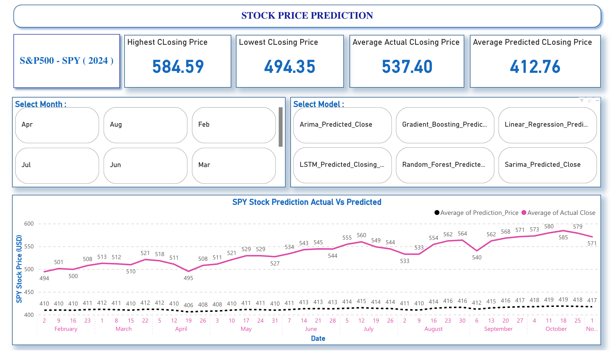
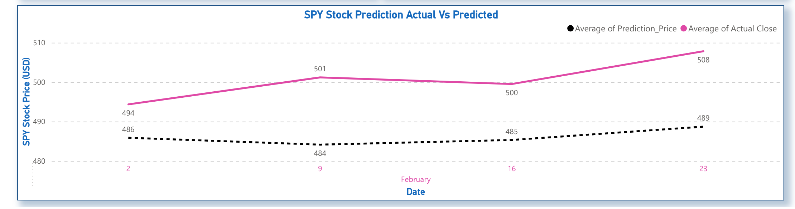

# 📈 Stock Price Prediction Dashboard

## 📌 Overview
This Power BI dashboard visualizes stock price predictions for selected companies using machine learning model outputs. It allows interactive exploration of predicted vs actual closing prices, ticker-based filtering, and historical trend analysis.

## 🔍 Key Features
- **Ticker Dropdown**: Filter the entire dashboard based on selected stock ticker (e.g., AAPL, AMZN, TSLA)
- **Prediction vs Actual Chart**: Visual comparison of predicted prices vs actual prices over time
- **Price Trend Chart**: Line chart showing historical stock prices by date
- **Data Table**: Tabular view of all prediction records including date, actual price, predicted price, and ticker

## 📎 Live Preview (if applicable)
[👉 View Dashboard on Power BI (Publish to Web)](https://app.powerbi.com/reportEmbed?reportId=2d3b1ef6-1b78-45af-8d58-372c902f3f3f&autoAuth=true&ctid=a8eec281-aaa3-4dae-ac9b-9a398b9215e7)

## 🛠 Tools Used
- Power BI Desktop
- Excel (ML output data)

## 📁 Project Files
- `Stock_Price_Prediction_dashboard.pbix`: Power BI dashboard file
- `images/`: Screenshots of key visuals
- `README.md`: Project documentation

## 📸 Dashboard Previews

